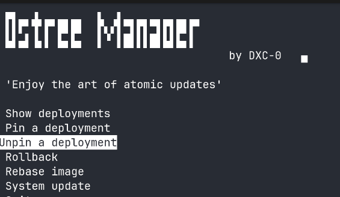

# ostree-manager

A simple script to manage rpm-ostree

## Usage

Clone the repository and go to the concerned folder.

```
git clone https://github.com/DXC-0/scripts.git
cd scripts/ostree
```

Execute from your favorite terminal.

```bash
chmod +x ostree-manager.sh
bash ostree-manager.sh
```

## Features

- Ultra-lightweight TUI
- Deployment tracking
- Easy pin management
- Rollback support
- Deployment display and rebasing
- System updates

## Intended usage

This script is designed for atomic fedora / ostree based images

<a href="./assets/ostree-manager.png">
  
</a>
